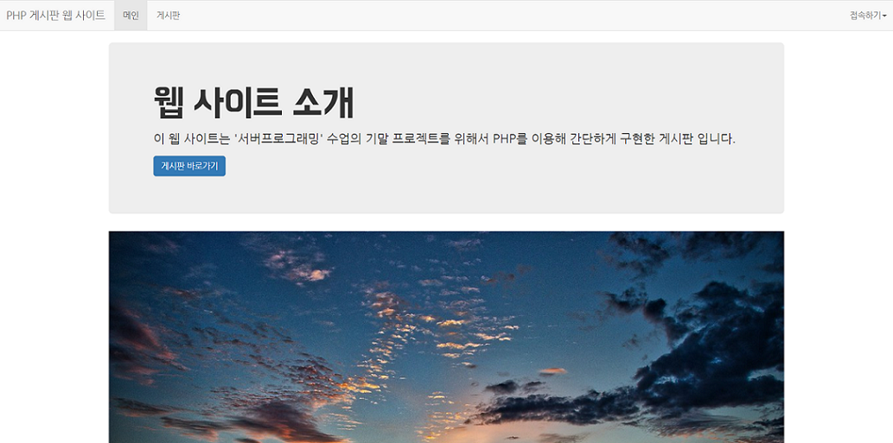

# BBS (Server Programming Final Project)
게시판 구현 프로젝트

### Preview

### Main Function
- 로그인, 회원가입, 로그아웃
- 게시판 CRUD
- <b>비밀 글</b>
- <b>페이징</b>
- <b>검색 기능 (제목, 글쓴이, 내용)</b>
- <b>댓글 기능</b>
- <b>관리자 기능 (게시물 관리, 댓글 관리)</b>

### Tech Stack
|Frontend       |Backend      |Database       |                   
|---------------|-------------|---------------|
|`Bootstrap`    |`PHP`        |`Maria DB`     |       

### Developer
- https://github.com/workhardslave (Seunghwan Hwang, 황승환)
